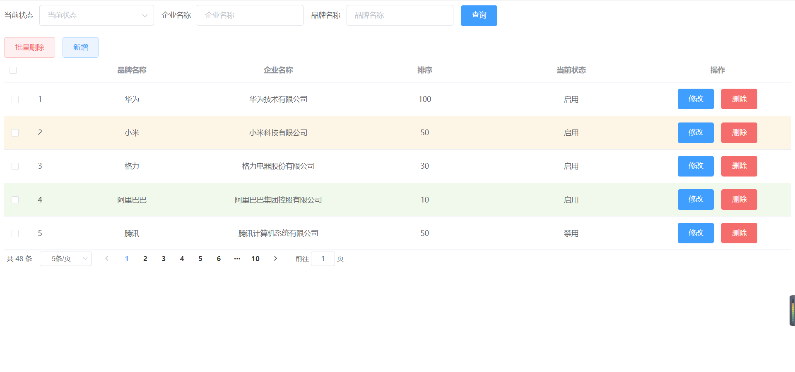
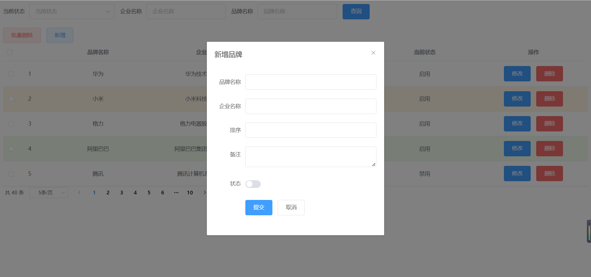
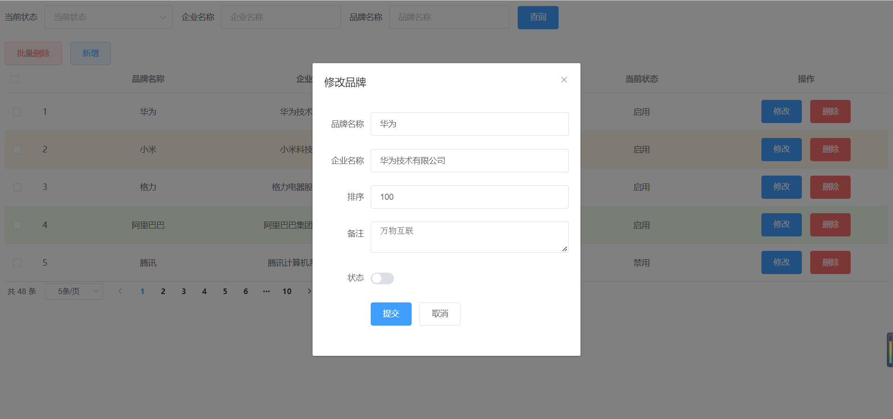
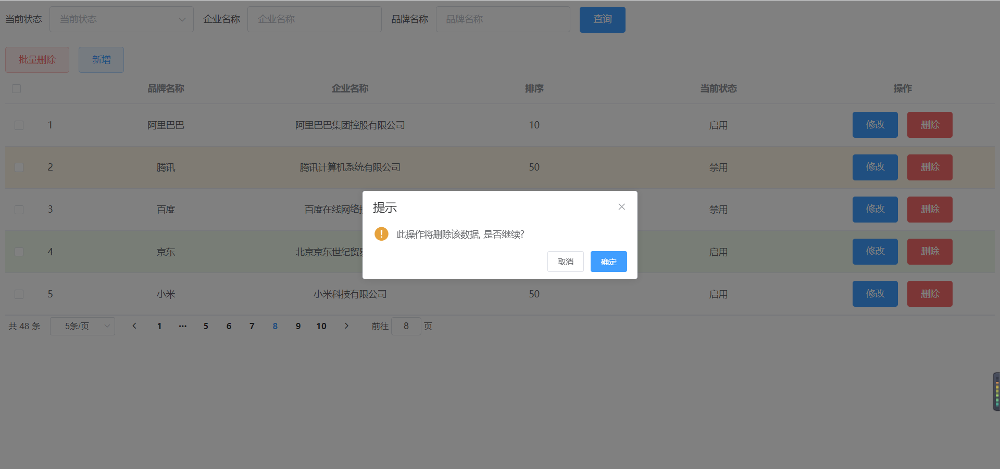
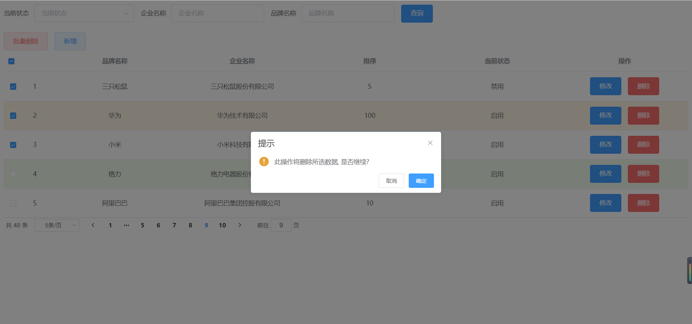
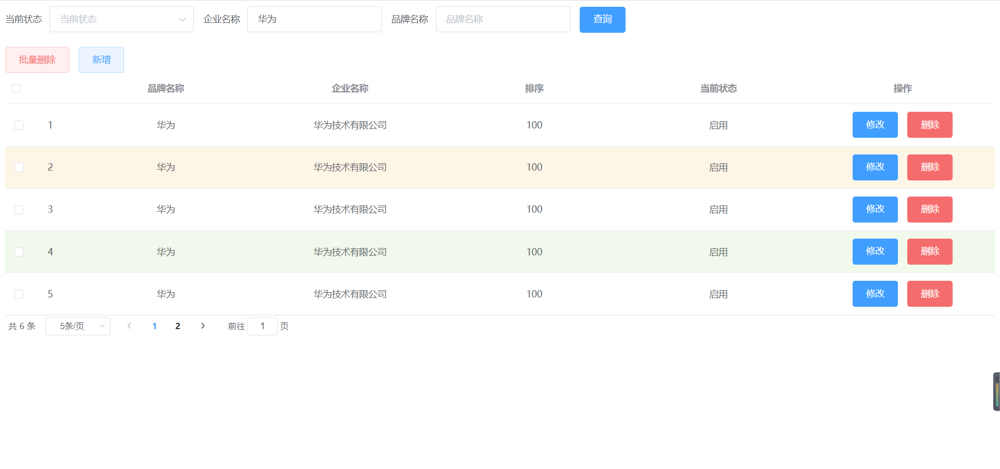

# JavaWebProgram
基于JavaWeb，数据库使用mybatis框架，前端使用vue、axios框架，采用MVC三层架构的方式实现增删改查等功能
涉及知识点：
* Java
* JavaScript
* HTML
* CSS
* servlet
* AJAX
* axios
* vue
* mybatis
* tomcat服务器
* mysql

## 程序功能展示
### 前端界面显示

* 前端界面组件采用Element——饿了么公司前端开发团队提供的一套基于Vue的网站组件库
* 从界面可以大概看出，本程序可以实现数据的添加、修改、删除、查询四大基本操作。
* 本程序可以实现分页功能，可以选取指定的页面展示数据条数
* 本程序可以实现条件查询功能，通过输入指定条件可以实现模糊查询

### 新增弹窗显示

* 通过自定义输入，可以新增相应品牌，点击提交后写入数据库

### 修改弹窗显示

* 点击修改后会弹出修改界面并实现数据回显，用户进行编辑操作后点击提交即可写入数据库

### 单个删除演示

* 点击删除按钮后会出现警告，再次确认后将删除数据库指定内容

### 批量删除演示

* 在左侧选定要删除的条目，点击批量删除后出现警告，再次确认后将删除所选数据

### 分页查询演示

* 在搜索框输入要筛选的条件，点击查询后，数据会以下面分页工具栏中指定数目显示

